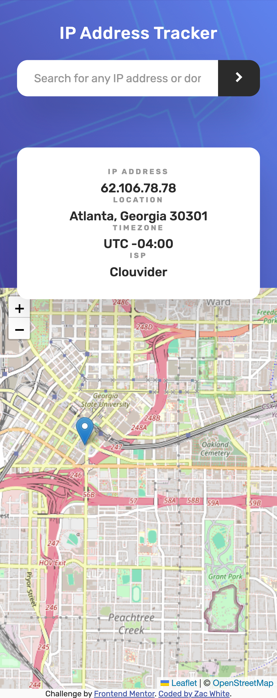

# IP Address Tracker Challenge - Frontend Mentor

 A responsive web application that tracks and displays geographic location data for any IP address or domain name, built as a Frontend Mentor Challenge.

 Challenge: [IP address tracker challenge on Frontend Mentor](https://www.frontendmentor.io/challenges/ip-address-tracker-I8-0yYAH0).

## Overview

This application uses two APIs working in tandem to deliver a seamless
lookup experience. On page load, it automatically detects and displays
the visitor's own IP address, location, timezone, and ISP on an
interactive map. From there, users can search any IP address or domain
name and instantly see its geographic information updated on the map in
real time. The interface is fully responsive, adapting cleanly between
mobile and desktop viewports, with accessible markup and visible focus
states throughout.

## Table of contents

- [The challenge](#the-challenge)
- [Screenshot](#screenshot)
- [Links](#links)
- [My Process](#my-process)
  - [Built with](#built-with)
  - [Useful resources](#useful-resources)
- [Setup](#setup)
  - [Prerequisites](#prerequisites)
- [Author](#author)
- [Reflections](#reflections)


## The challenge

Users should be able to:

- View the optimal layout for each page depending on their device's screen size
- See hover states for all interactive elements on the page
- See their own IP address on the map on the initial page load
- Search for any IP addresses or domains and see the key information and location

## Screenshot



## Links

- **Live Site URL:** [IP Address Tracker](https://zstem001hz-droid.github.io/ip-address-tracker/)

## My Process

### Built with

- Semantic HTML5
- CSS Custom Properties
- Flexbox
- Mobile-first responsive design
- Vanilla JavaScript (ES6+)
- [LeafletJS](https://leafletjs.com/) - interactive map rendering
- [IPify Geolocation API](https://geo.ipify.org/) - IP address lookup
- [IPify Simple API](https://api.ipify.org) - user IP detection
- [OpenStreetMap](https://www.openstreetmap.org/) - map tile imagery
- [Node.js/Express](https://expressjs.com/) - backend proxy server
- [Render](https://render.com/) - backend deployment

### Useful resources

- [OWASP API Security Project](https://owasp.org/www-project-api-security/) - API security best practices, referenced during API key management decisions
- [Render - Deploy Node.js/Express](https://render.com/docs/deploy-node-express-app) - step-by-step guide to deploy the backend proxy
- [Render - First Deploy](https://render.com/docs/your-first-deploy) - Render's getting started guide
- [LeafletJS Documentation](https://leafletjs.com/reference.html) - API reference for map initialization, tile layers, and markers
- [LeafletJS Quick Start](https://leafletjs.com/examples/quick-start/) - Leaflet's quick start guide for map implementation
- [IPify API Documentation](https://geo.ipify.org/docs) - geolocation API documentation including response structure and authentication
- [MDN - Flexbox](https://developer.mozilla.org/en-US/docs/Learn_web_development/Core/CSS_layout/Flexbox) - header, search form, and info card layout
- [MDN - CSS Reference](https://developer.mozilla.org/en-US/docs/Web/CSS/Reference) - authoritative reference for CSS properties
- [MDN - Destructuring](https://developer.mozilla.org/en-US/docs/Web/JavaScript/Reference/Operators/Destructuring_assignment) - extract data from IPify API response
- [MDN - calc()](https://developer.mozilla.org/en-US/docs/Web/CSS/Reference/Values/calc) - calculates map container height dynamically
- [MDN - Using media queries](https://developer.mozilla.org/en-US/docs/Web/CSS/Guides/Media_queries/Using) - mobile-first responsive breakpoints
- [MDN - Fetch API](https://developer.mozilla.org/en-US/docs/Web/API/Fetch_API) - handles API calls to the backend proxy
- [MDN - Async/Await](https://developer.mozilla.org/en-US/docs/Learn/JavaScript/Asynchronous/Promises) - JavaScript async function patterns

## Setup

### Prerequisites

- A modern web browser
- No installation required to use live site

### To run locally

1. Clone the repository:
\```bash
git clone https://github.com/zstem001hz-droid/ip-address-tracker.git
cd ip-address-tracker
\```

2. Open `index.html` with VS Code Live Server

3. The app uses a hosted backend proxy at:
`https://ip-tracker-server.onrender.com`
No local backend setup required.

### To run your own backend proxy

1. Clone the backend repository:
\```bash
git clone https://github.com/zstem001hz-droid/ip-tracker-server.git
cd ip-tracker-server
\```

2. Install dependencies:
\```bash
npm install
\```

3. Create a `.env` file:
\```
IPIFY_API_KEY=your_api_key_here
\```

4. Get a free API key at [geo.ipify.org](https://geo.ipify.org)

5. Start the server:
\```bash
node server.js
\```

6. Update `BASE_URL` in `scripts/app.js` to `http://localhost:3000/api/lookup`

## Author

- **Zac White**
- GitHub - [@zstem001hz-droid](https://github.com/zstem001hz-droid)

## Reflections

Building the IP Address Tracker was one of the more rewarding projects I have 
taken on. My typical approach begins with drafting an outline in index.html 
while reflecting on the CSS styles and JavaScript patterns the final product 
will require. It may seem abstract, but it is rooted in a linear, logical 
process that keeps the full picture in mind from the start.

Two challenges stood out during development. The first was CSS — my creative 
side wanted to take over, but my familiarity with CSS is still developing. I 
spent considerable time peeling through MDN documentation and other online resources 
to bridge that gap. The second challenge was API key security. I have 
professional experience working with APIs and understand the implications of 
an exposed key. Even with IPify's minimal risk profile, the idea of coding an 
API key into JavaScript and pushing it to a public repository gave me serious 
pause. That led me to make a deliberate decision to build a backend proxy on 
Render to house the key server-side — a decision rooted in years of 
cybersecurity experience. It added time to the project, but it was the right 
call and a satisfying refresh on API security practices.

What surprised me most was how my introduction to TypeScript made JavaScript 
feel more negotiable. Something about working through TypeScript's structure 
made JavaScript's patterns click in a new way. The other surprise was Leaflet 
— seeing the map render and then move to my actual location with just a small 
block of code was genuinely exciting, and I nearly jumped out of my seat. 
It made me glad I chose this project.

If I had more time, I would push the design further — experimenting with CSS libraries 
like Tailwind or Bootstrap, and making the interface more distinctly my own rather than 
adhering strictly to Frontend Mentor's specifications.  

The biggest takeaway from this project is learning to trust the documentation. Every 
tool used here — Leaflet, IPify, Express, Render — had the answers I needed in their docs. 
Paying close attention to those resources, their security practices, and the possibilities 
they offer opened up solutions I wouldn't have found otherwise. That habit will carry 
into all my future projects and is likely to make me a more deliberate and capable developer.
